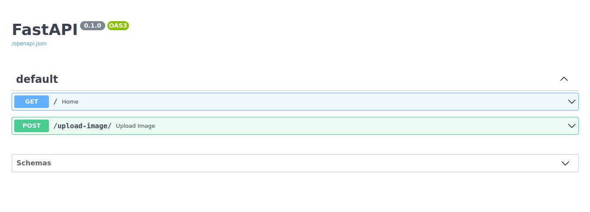

# CIFAR_DOCKER

This repository serves as a guide to deploying a PyTorch model trained on the CIFAR-10 dataset using the VGG neural network architecture. The deployment is achieved through FastAPI, creating endpoints that allow users to submit an image for prediction via a provided URL. This README file provides an overview of the key components and steps involved in deploying the model within a Docker container.

## My Works

In this repository, I accomplished the following tasks:

- Trained a PyTorch model using the VGG neural network on the CIFAR-10 dataset.
- Implemented a FastAPI application to create endpoints for image prediction.
- Utilized Docker to containerize the application for easy deployment.
- Dockerfile and .dockerignore
- Dockerfile: Describes the steps to build a Docker image for your application. It includes instructions for installing dependencies, copying the application code, and exposing the necessary ports.
- .dockerignore: Lists files and directories that should be excluded from the Docker build context. This helps reduce the size of the Docker image by excluding unnecessary files, such as local development artifacts and temporary files.

## Repo Structure and Files

**app**

|-- model/

|---|-- checkpoint/

|---|---|-- ckpt.pth         # PyTorch model's saved checkpoint with the best epoch accuracy and state_dict

|---|-- model.py             # Python script defining and loading the PyTorch model (VGG19) and inference function

|---|-- main.py              # FastAPI implementation for creating endpoints and handling image prediction

|-- Dockerfile               # Docker configuration file for building the application image

|-- .dockerignore            # List of files and directories to be excluded from the Docker build context

|-- requirements.txt         # File containing Python dependencies for the application

|-- result.jpg               # Screenshot of FastAPI :80/docs page showing relevant information about the app

## Machine Learning Models in Docker

Docker provides an efficient and consistent way to package, ship, and deploy machine learning models. Containerization allows you to encapsulate the model, its dependencies, and the runtime environment, ensuring that the model behaves consistently across different systems.

## Important Docker Commands
- Build an Image: docker build -t image_name . - Builds a Docker image from the current directory.
- Run a Container: docker run -p host_port:container_port image_name - Starts a Docker container from the specified image, mapping the host port to the container port.
- List Containers: docker ps - Lists running containers.
- Stop a Container: docker stop container_id - Stops a running container.
- Remove a Container: docker rm container_id - Removes a stopped container.
- List Images: docker images - Lists Docker images.
- Remove an Image: docker rmi image_id - Removes a Docker image.

## Other Important Topics

**Docker Compose**

Docker Compose allows you to define and manage multi-container Docker applications. It's particularly useful for orchestrating complex setups involving multiple services.

**Docker Volumes**

Docker Volumes can be employed to persist data generated by the application. This is especially important for storing model weights, ensuring they persist even if the container is restarted.

**Model Versioning**

Implementing model versioning strategies, such as Semantic Versioning, ensures a systematic approach to managing and deploying different versions of your machine learning models.

**Continuous Integration/Continuous Deployment (CI/CD)**

Integrating Docker with CI/CD pipelines streamlines the process of building, testing, and deploying your application. Services like Jenkins, GitLab CI, or GitHub Actions can be configured to automate these workflows.

## Conclusion
This repository aims to provide a comprehensive guide for deploying PyTorch models using Docker, emphasizing the importance of reproducibility, consistency, and ease of deployment. Feel free to adapt the provided instructions to your specific use case and expand upon them as needed. Happy coding!

